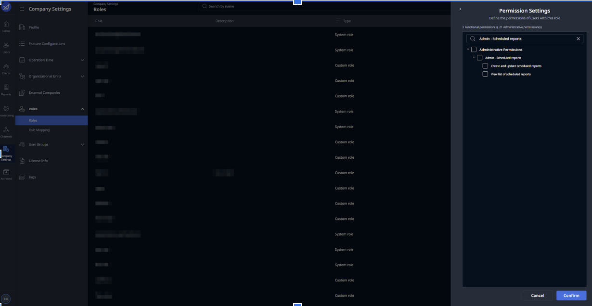
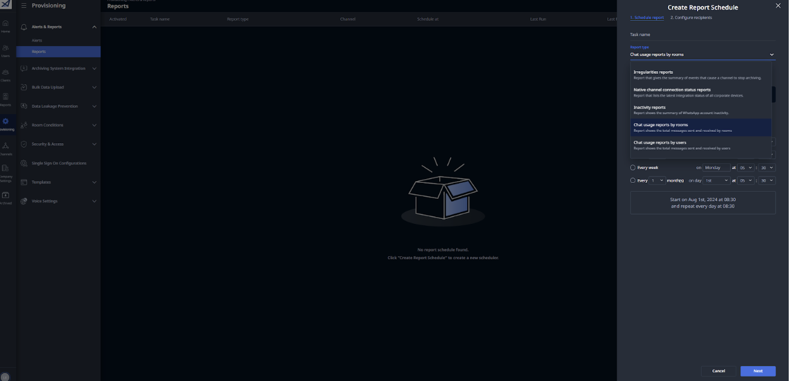
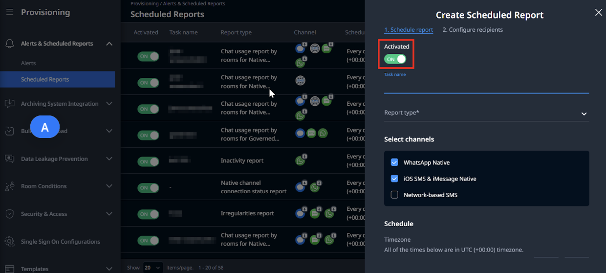
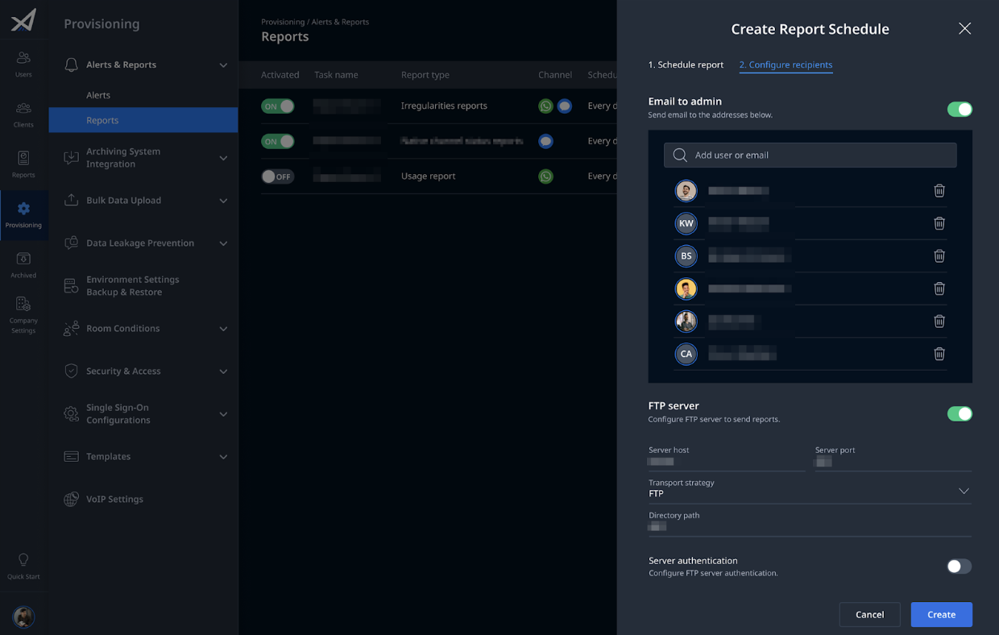
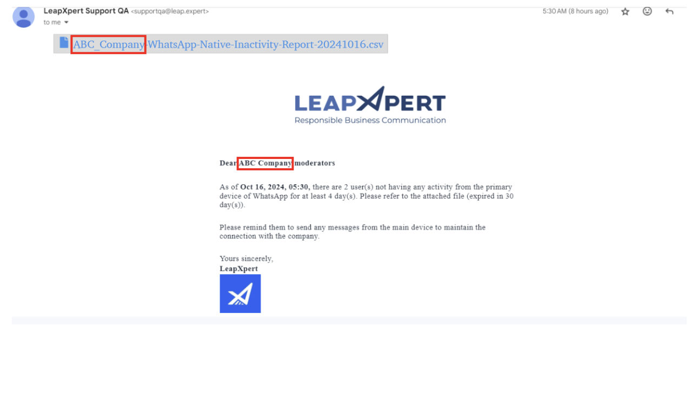
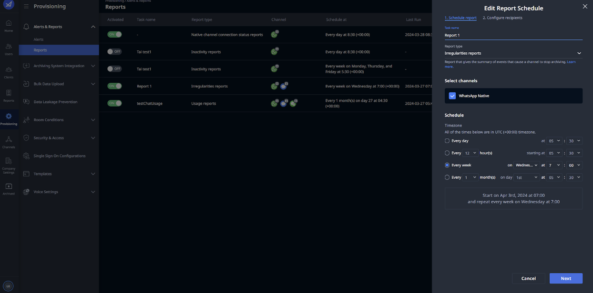
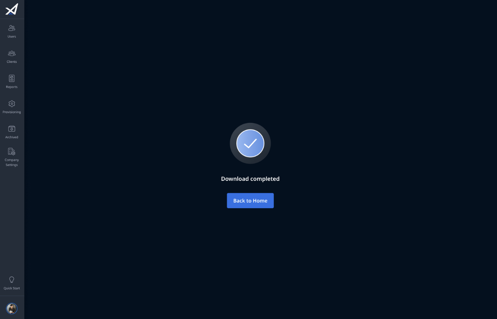
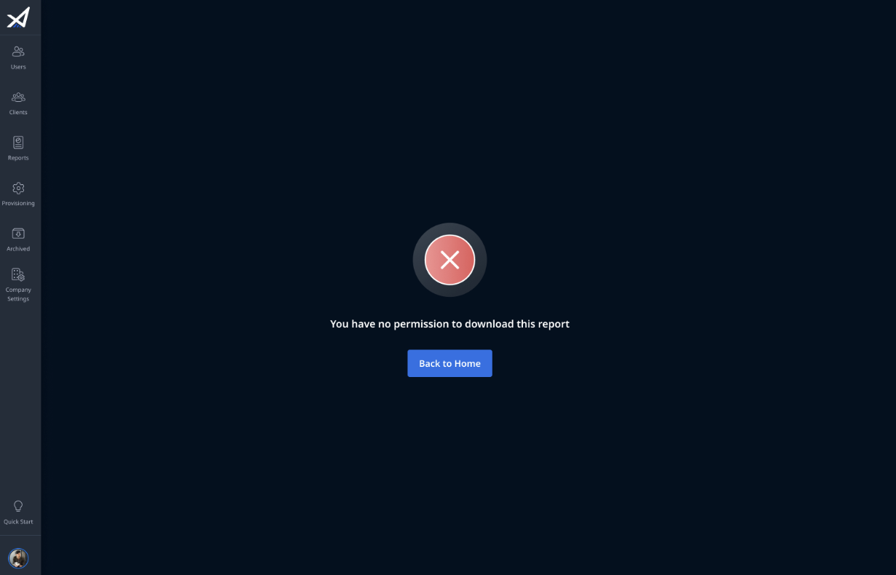

# Create a Scheduled Report

**Scheduled Reports** are `.CSV` files automatically sent to users via email or uploaded to an FTP server at pre-configured intervals.  
Unlike **Dashboard reports** (which typically cover data from 00:00 to 23:59), **Scheduled Reports** can be set to start at any time during the day.

This article provides instructions on how to **create, configure, and edit Scheduled Reports** in the Org Admin portal, along with an overview of the available report types.

---

## Before You Start

- You must be using **LeapXpert version 2.2.0 onwards**.  
- The company admin must have the following permissions: 
  - All permissions under **Admin - Scheduled reports**.

---

## Available Scheduled Report Types

LeapXpert currently supports the following report types:

1. **Native channel connection status report (Health check report)**  
   Provides a list of all corporate phone numbers and their integration status with native channels.  
   ➝ See: *WhatsApp Native connection status reports* and *iMessage Native connection status reports*. (internal link).

2. **WhatsApp inactivity report**  
   Lists inactive WhatsApp accounts that might impact archiving.  
   ➝ See: *WhatsApp Native inactivity reports*. (internal link).

3. **Chat Usage report by Company** *(no longer supported)*  

4. **Chat Usage report by Rooms**  
   Shows total messages sent/received per chat room.  
   ➝ See: *WhatsApp Native usage reports*, *iMessage Native usage reports*, *Network-based SMS Native chat usage reports* (internal link) (from version 2.4.1 onwards).

5. **Chat Usage report by Users**  
   Shows total messages sent/received per User within a pre-configured period of time.  
   ➝ See: *WhatsApp Native usage reports*, *iMessage Native usage reports*, *Network-based SMS Native chat usage reports* (internal link) (from version 2.4.1 onwards).

6. **Communication Compliance report**  
   Provides a daily summary of Data Leakage Prevention (DLP) violations and Room Condition violations.  
   ➝ See: *Communication compliance reports*. (internal link).

7. **WhatsApp and iMessage Native Irregularities report**  
   Summarizes events that cause native channels to stop archiving.  
   ➝ See: *WhatsApp Native irregularities reports*, *iMessage Native irregularities reports*. (internal link).

8. **WeCom Native Irregularities report**  
   Summarizes irregular communication events in WeCom rooms, such as:  
   - Unusual client statuses  
   - Anonymous contacts detected in the chat room. 
   - Group messages will not be archived as selected by the client.
   ➝ See: *WeCom Native irregularities reports* (internal link).
   *(From version 2.6.0 onwards, filterable per Org Unit)*

9. **Archiving Export Email Summary report**  
   Summarizes archiving export emails sent to the archival system within a pre-configured period of time. The report includes the total number of emails sent, along with a .csv file containing detailed information about each exported email. 
   ➝ See: *Export task email summary reports (SMTP protocol)* (internal link).

10. **Room Metadata report**  
    Provides details of all governed chat rooms.  
    ➝ See: *Chat rooms metadata Scheduled Report* (internal link).

> Notes
>- Not all reports are configurable via the Org Admin portal. Contact **Customer Support** if you don’t see a required type.  
>- From **version 2.3.2 onwards**, multiple schedules per report type are supported.  
>- A company can have up to **100 active scheduled report tasks**.  

---

## Available Intervals

The table below explains how Scheduled Reports operate depending on configuration:

| **Option**                          | **Allowed Values** | **How it Works** | **Example** |
|-------------------------------------|--------------------|------------------|-------------|
| Every day at `hh:mm`                | Any time           | Runs once daily at the set time. | Daily at 06:30 → Report covers data from 06:30 yesterday to 06:30 today. |
| Every X hours starting at `hh:mm`   | 1, 2, 3, 4, 6, 12  | Repeats daily at set intervals. | Every 4 hours starting at 06:30 → Reports at 06:30, 10:30, 14:30, 18:30. |
| Every week on weekday at `hh:mm`    | Mon–Sun            | Runs weekly at the set day/time. | Every Monday at 06:30 → Covers data from 06:30 last Monday to 06:30 this Monday. |
| Every X months on day `dd` at `hh:mm` | 1–28              | Runs monthly at the chosen date/time. | Every 3 months on 1st at 06:30 → Runs on Feb 1, May 1, Aug 1, Nov 1. |

---

## Create a Scheduled Report

To configure a scheduled email/FTP report:

1. Sign in to the **Organization Admin**.  
2. Navigate to **Provisioning > Alerts & Reports > Scheduled Reports**.  
3. Select **Create Scheduled Report**.  
4. The **Create Scheduled Report** dialog opens.  
> From version **2.4.1 onwards**, the *Activated toggle* defaults to **ON** (no need to enable manually).  
5. In the **Schedule report** tab, configure: 
   - **Task name**: name of the task.  
   - **Report type**: select from [Available types](#available-scheduled-report-types). 
   - **Select channels**: choose channels to extract data.  
   - **Select the schedule**: configure intervals (see [Available intervals](#available-intervals)).  
6. Click **Next** to configure recipients.   
7. In the **Configure recipients** tab, choose methods:
   - **Email to admin**: enter recipient’s email(s). Use the trash icon to remove addresses.  
   - **FTP server** (only for Native channel status reports): provide:
     - Host & Port  
     - Transport: SFTP or FTP  
     - Authentication: Username/password  
     - Proxy (optional). Input credentials for the above methods for server authentication and connectivity. Disable the method that does not apply to you.   

8. Enter credentials for authentication and connectivity.  
9. Click **Save**.  

✅ You have successfully created a Scheduled Report.  

> From version **2.4.1**, the **company (tenant) name** is displayed in the email content and `.csv` file.    

---

## Edit a Report Schedule

⚠️ Reports in **Running** status cannot be edited.

To edit:

1. Sign in to **Organization Admin**.  
2. Go to **Provisioning > Alerts & Reports > Scheduled Reports**.  
3. Select **Edit** (pencil icon) for the report.  
4. Update fields as required.   
5. Click **Save**.  

---

## Download and View Reports

- When receiving a report email, users must log in to the Org Admin portal to download.  
- Downloading requires appropriate **permissions**.  
 
-  Without them, users will see an **error message**.  
- When we upgrade your environment to version **2.3.1**, a role `scheduled-reports.viewer` will be automatically created and assigned to users whose email addresses are configured as recipients of any scheduled reports. The role consists of following permissions that allow users to download reports. 
All those permissions are included in the Admin - Scheduled reports permission.

| Permission | Type | Description |
|---|---|---|
|Download Native Channel Connection Status report | ADMINISTRATIVE |Allow download Native Channel Connection Status report sent via email |
| Download inactivity report | ADMINISTRATIVE |Allow download Inactivity report sent via email |
| Download Usage By Company report  | ADMINISTRATIVE |Allow download Chat Usage By Company (Metrics) report sent via email. ` ` *Note: This report is temporarily not on the UI now.*  |
| Download Communication Compliance report | ADMINISTRATIVE | Allow download Communication Compliance report sent via email.` ` *Note: This report is visible on the Org Admin portal from version 2.3.2 onwards.*|
| Download Usage by Rooms report| ADMINISTRATIVE | Allow download Chat Usage By Rooms report sent via email |
| Download Usage by Users report| ADMINISTRATIVE | Allow download Chat Usage By Users report sent via email |
| Download WeCom irregularities report| ADMINISTRATIVE | Allow download WeCom Irregularities report sent via email.` ` *Note: This report is temporarily not on the UI now.*|
| Download Other Native Channel irregularities report| ADMINISTRATIVE | Allow download Other Native Channel Irregularities report sent via email|
| Download Archiving Export Email Summary report| ADMINISTRATIVE | Allow download Archiving Export Email Summary report sent via email. ` ` *Note: From version 2.4.1 onwards, users can configure this type of report on the Org Admin portal.*|

---

## Limitations

- `scheduled-reports.viewer` **cannot** be assigned to group emails (admins must assign manually per user).  
- If your company uses **SSO**, automatic role assignment may be overridden at login.  
  ➝ Recommendation: create a **custom role** with scheduled report permissions and map roles for all recipients.  
- Reports created **before this update** may need rescheduling to align with new features.  

---

